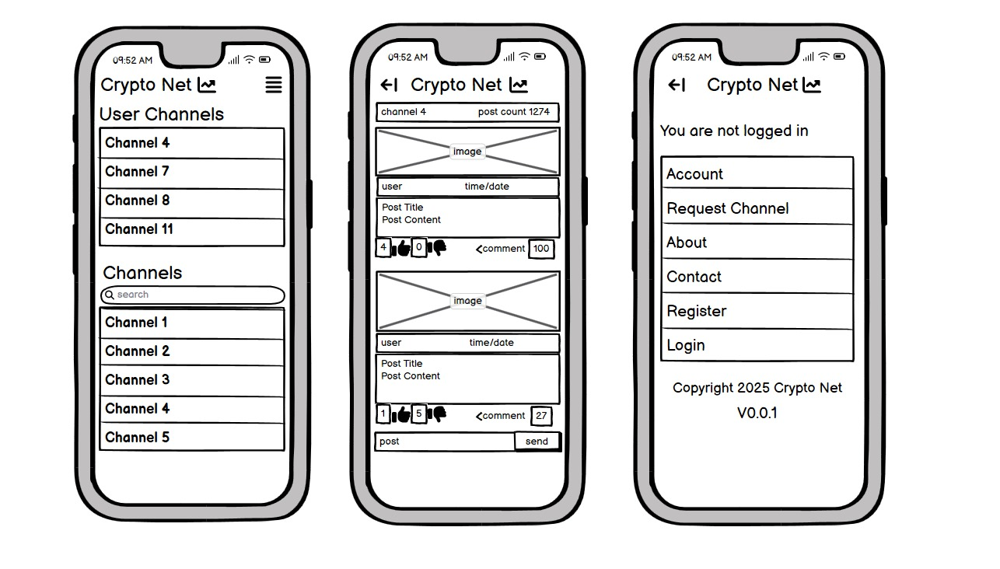
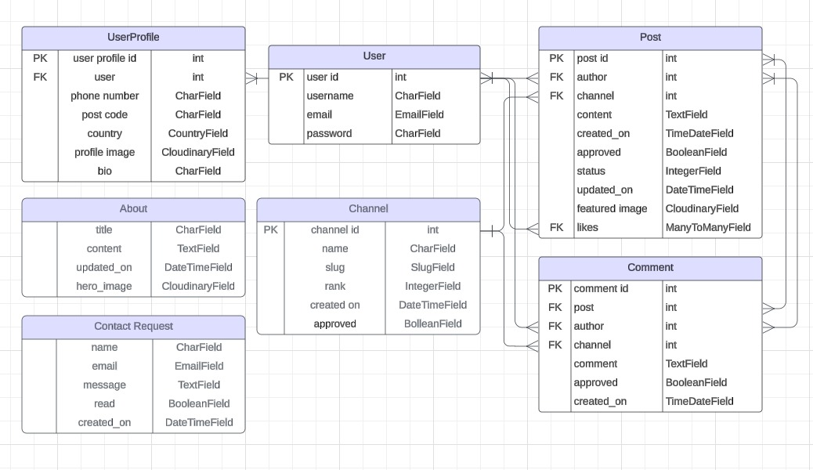
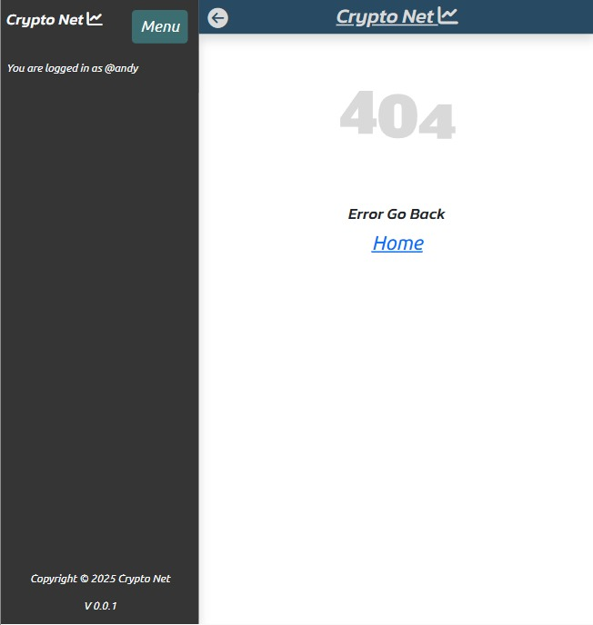

# Crypto Net

Crypto Net is a social networking platform designed specifically for individuals interested in cryptocurrencies, blockchain technology, and the rapidly evolving world of digital finance. This platform is tailored to those who want to stay updated with the latest trends, news, and discussions related to various crypto assets and projects. It is a hub where users can share their insights, articles, and commentary, as well as engage in conversations about all things crypto.

[Here is the live version of my project](https://cryptonet-0fc8d0019661.herokuapp.com/)

## User Story
**New User**
- I want to know what the site is for
- I want to easily use the platform, so that I can quickly start interacting
- I want to be able to look through content with minimal effort
- I want to be able to see content clearly and see the discussions in the comments
- I want to be able to see what channels are most popular with the most content and activity

**Returning User**
- I want to come back and see new content
- I want to be able to keep up to date with my favorite crypto currencies
- I want to add a post for new content
- I want to view comments on my post and join in with the discussions
- I want to see if there are any new channels
- I want to add a new channel for my favorite crypto currency

**Other Customer Scenarios**

**Site Adminstrator**
- As a site administrator, the platform should run smoothly and remain secure.
- As a site administrator, that the site remain.

- Using an agile approach with project board for user storys
 

## Features

### Wire Frames

- **Desktop**

- **Mobile**

The wire frames were made using [Balsamiq](https://balsamiq.com/)

### Entity Relationship Diagram

The diagram was made using [Lucid Chart](https://www.lucidchart.com/)

### Typography

- **The site uses the following fonts:**
  - Base: [Ubuntu](https://fonts.google.com/specimen/Ubuntu)
  - Headers: [Kanit](https://fonts.google.com/specimen/Kanit)

The fonts were imported from [Google Fonts](https://fonts.google.com/)

### Color Scheme

- **The site uses the following colors:**
  - Jet: rgb(53, 53, 53)
  - Caribbean Current: rgb(60, 110, 113)
  - White: rgb(255, 255, 255)
  - Platinum: rgb(217, 217, 217)
  - Indigo Dye: #rgb(40, 75, 99)

This color pallet was made in [Coolors](https://coolors.co)

- **Additional colors**
  - Black from [Bootstraps](https://getbootstrap.com/docs/5.3/utilities/background/) default colors

### Home

### About

### Contact

### Request Channel

- **Input message return**

### Channel

- **Input message return**

### Post

- **Input message return**

### Account

### Profile

### 404 Page

- Animated 404.svg from [Loading](https://loading.io/)
- Information on 404 page [W3S](https://www.w3schools.com/django/django_404.php)

## Future Features
How deep is the rabbit hole?

With more time I would like to add the following features:

- An istance to like, delete or edit posts within the profile_detail template
- Edit and delete username/user functionality
- Channel search bar
- User fvorite channel list
- Email verification
- Report functionality
- CoinGecko API dynamic data input and channel validation

## Requirements

### Tools
- **Gunicorn** Python HTTP server for WSGI applications
- **Whitenoise** for serving of static files
- **Cloudinary** cloud storage for images

### Libraries
- **Psycopg2** Python PostgreSQL database adapter
- **Django Allauth** registration authentication managment
- **Django Crispy forms** super easy serving of crispy forms
- **Django Summernote** for rich text editing in admin panel
- **Django Countries** provides country choices for use with forms

## Deployment
This project was deployed using Heroku

**PostgreSQL**

This project uses PostgreSQL database provided by Code Institue

**Cloudinary API**

This project uses [Cloudinary](https://cloudinary.com/) for storing media files

- **Steps for deployment**
  - Fork or clone this [repository](https://github.com/AndyV773/pp4)
  - You can install all requirements by typing in the terminal:

  ` pip3 install -r requirements.txt `

  - Ensure Procfile is added with the correct command to run gunicorn: 

  `web: gunicorn cryptonet.wsgi`

  - Ensure runtime.txt has the correct python version:

  `python-3.12`

  - Create a new Heroku app
  - Add Config Var in Heroku's settings, click Reveal Config Vars. Here is an example:

  | key | Value |
  | --- | --- |
  | DATABASE_URL | <your_database_url> |
  | SECRET_KEY | <your_secret_key> |
  | CLOUDINARY_URL | cloudinary://<your_api_key>:<your_api_secret>@dpwhdmvce |
  | DISABLE_COLLECTSTATIC | 1 (Can be used to temporary disable collection of static files) |

  - Set Environment Varibles here is [.env.example](https://github.com/AndyV773/pp4/blob/main/.env.example)

  - Link the Heroku app to the repository
  - Click on **Deploy**

## Testing
> **Note:**
>
> For Testing, please refer to [TESTING.md](TESTING.md)

## Credits
### Content

- Code Institute for [Code Institute Blog](https://github.com/Code-Institute-Solutions/blog/) and deployment to Heroku
- [Django Project](https://www.djangoproject.com/)
- [Boot Strap](https://getbootstrap.com/docs/)
- [W3S](https://www.w3schools.com/)
- [Stack Overflow](https://stackoverflow.com/)
- [Lucid Chart](https://www.lucidchart.com/)
- [Balsamiq](https://balsamiq.com/)
- [Cloudinary](https://cloudinary.com/)
- The icons used were taken from [Font Awesome](https://fontawesome.com/)
- Animated 404.svg was from [Loading](https://loading.io/)
- Optimise images with [Free Convert](https://www.freeconvert.com/)

### Media

- Images were created using Grok from [X](https://x.com/)
