# Crypto Net

Crypto Net is a social networking platform designed specifically for individuals interested in cryptocurrencies, blockchain technology, and the rapidly evolving world of digital finance. This platform is tailored to those who want to stay updated with the latest trends, news, and discussions related to various crypto assets and projects. It is a hub where users can share their insights, articles, and commentary, as well as engage in conversations about all things crypto.

[Here is the live version of my project](https://cryptonet-0fc8d0019661.herokuapp.com/)

## User Story
**New User**
- I want to know what the site is for
- I want to easily use the platform, so that I can quickly start interacting
- I want to be able to look through content with minimal effort
- I want to be able to see content clearly and see the discussions in the comments
- I want to be able to see what channels are most popular with the most content and activity

**Returning User**
- I want to come back and see new content
- I want to be able to keep up to date with my favorite crypto currencies
- I want to add a post for new content
- I want to view comments on my post and join in with the discussions
- I want to see if there are any new channels
- I want to add a new channel for my favorite crypto currency

**Site Adminstrator**
- As a site administrator, the platform should run smoothly and remain secure.
- As a site administrator, that the site remain.

- Using an agile approach with project board for user storys
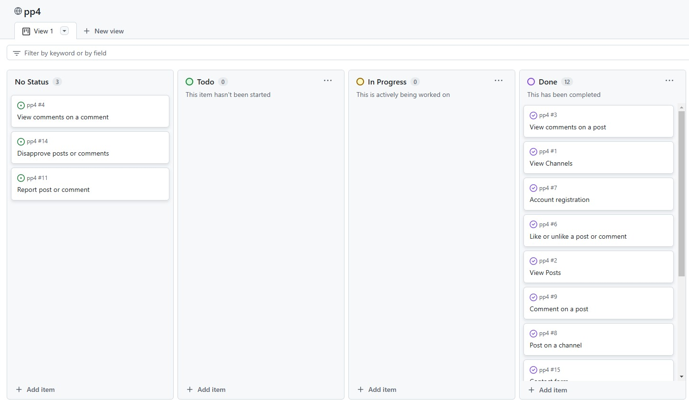 

## Features

### Wire Frames

- **Desktop**

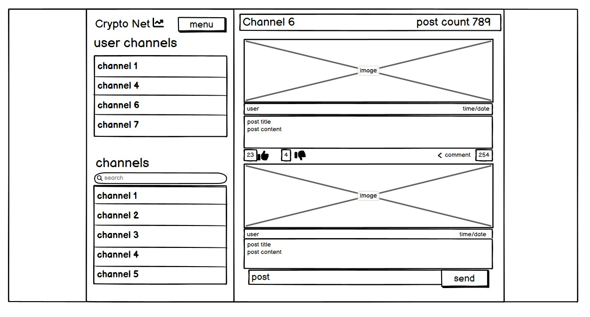

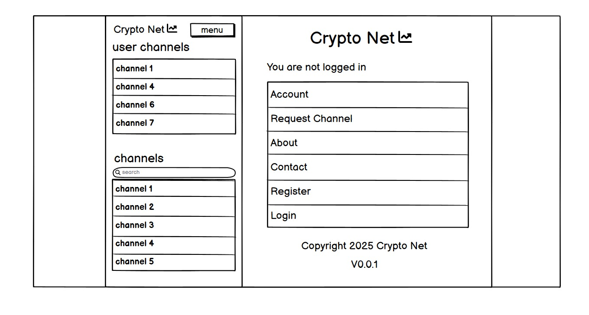

- **Mobile**

The wire frames were made using [Balsamiq](https://balsamiq.com/)

### Entity Relationship Diagram

The diagram was made using [Lucid Chart](https://www.lucidchart.com/)

### Typography

- **The site uses the following fonts:**
  - Base: [Ubuntu](https://fonts.google.com/specimen/Ubuntu)
  - Headers: [Kanit](https://fonts.google.com/specimen/Kanit)

The fonts were imported from [Google Fonts](https://fonts.google.com/)

### Color Scheme

- **The site uses the following colors:**
  - Jet: rgb(53, 53, 53)
  - Caribbean Current: rgb(60, 110, 113)
  - White: rgb(255, 255, 255)
  - Platinum: rgb(217, 217, 217)
  - Indigo Dye: #rgb(40, 75, 99)

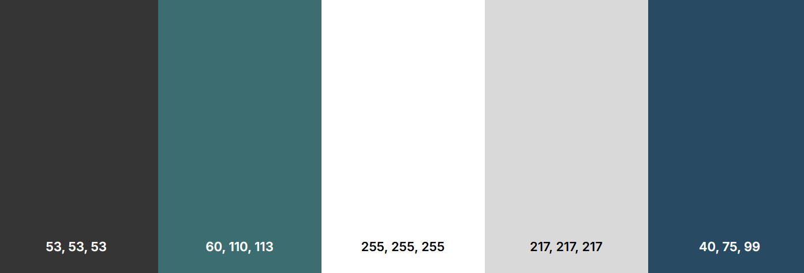

This color pallet was made in [Coolors](https://coolors.co)

- **Additional colors**
  - Black from [Bootstraps](https://getbootstrap.com/docs/5.3/utilities/background/) default colors

### Home
**Resposive Design**

The design of the home page displays only the channels on small devices using JavaScript, while on large devices, it shows the channels along with a large image

This includes:
- A list of approved channels and there rankings in order of rank
- A Login/logout user display message
- Copyright information with a dynamically updated date

- Home desktop

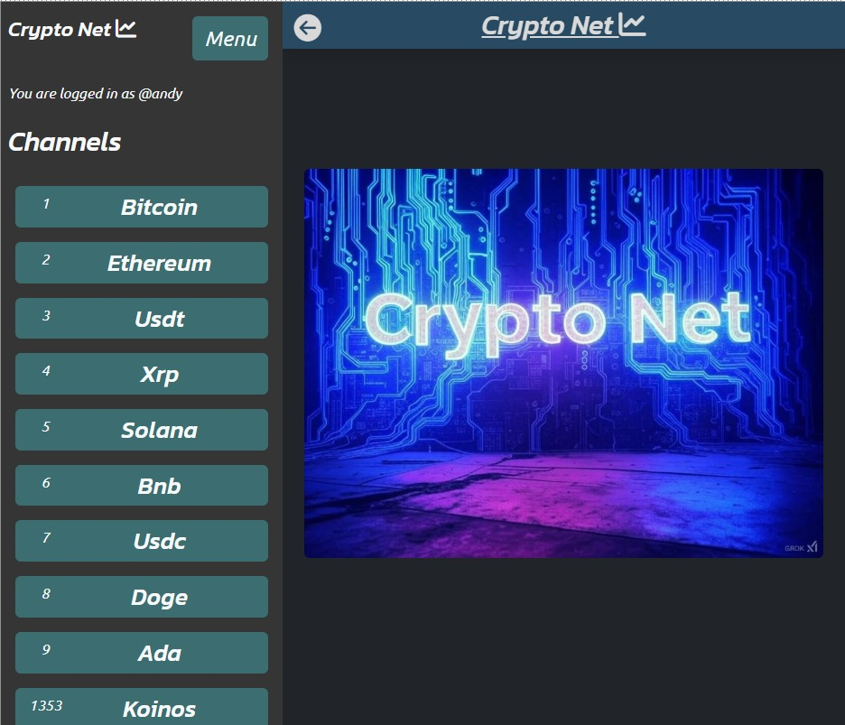

- Home mobile

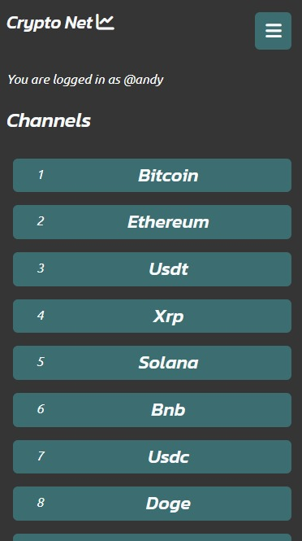

### Navigation

The naviagtional menu was used from [W3S Sidenav](https://www.w3schools.com/howto/tryit.asp?filename=tryhow_js_sidenav_full). It slides in from the right and displays content for both authorized and unauthorized users. It also adjusts to the screen size, covering the full screen on small devices and 67% on large devices, ensuring the channel list remains visible. Additionally, it includes copyright information with a dynamically updated date

- Authorised user navigation menu content includes
  - Account
  - Profile
  - About
  - Contact
  - Request Channel
  - Logout

- Authorised access on large devices

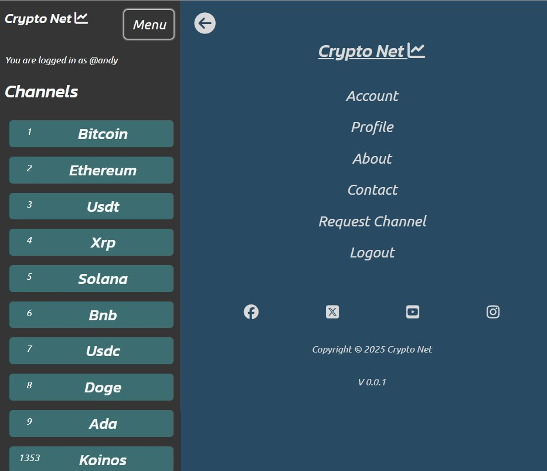

- unauthorised user navigation is restricted too
  - About
  - Contact
  - Reqister
  - Login

- Unauthorised access on small devices

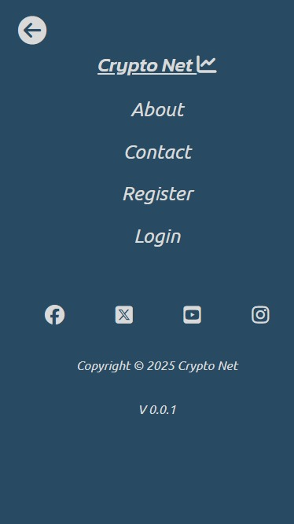

### About

The about page consists of a image, title and content that can be added from the admin panel. It also displays the date it was updated and includes a button linking to the contact page

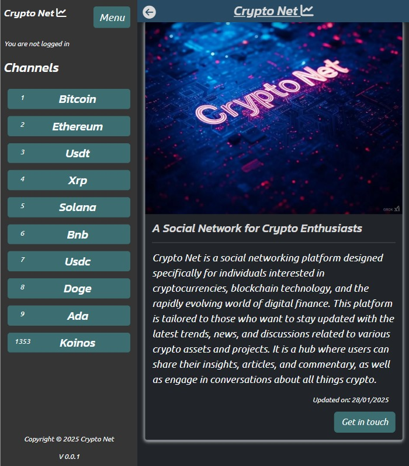

### Contact

The user can send a contact request to the admin via the contact form. They must include a name, valid email, and message. If the user is authorised, the name and email fields will be autofilled with their data

- Unauthorised user

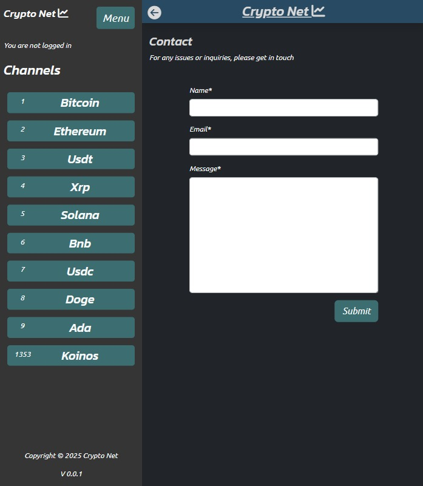

- Authorised user

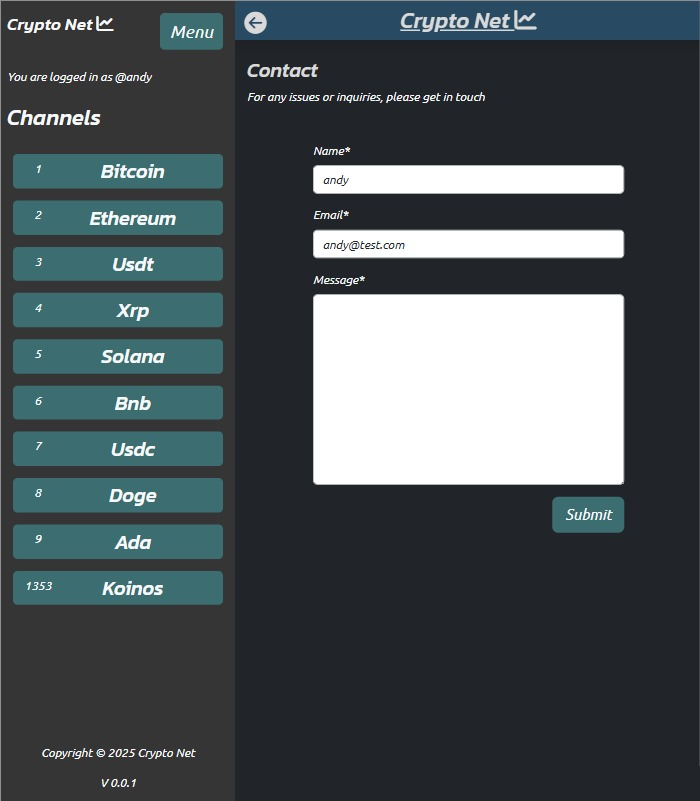

### Request Channel

If the user is authorized, they can submit a channel request to be approved by the admin. The goal is to only allow approved cryptocurrency channels that are listed on CoinGecko. A future feature will handle this via the CoinGecko API, but for now, it is managed through the admin panel. The user can only request channels that do not already exist. A validation error will be thrown if the same channel is requested twice, regardless of case (for example, "Bitcoin" or "bitcoin")

- Approved channel message

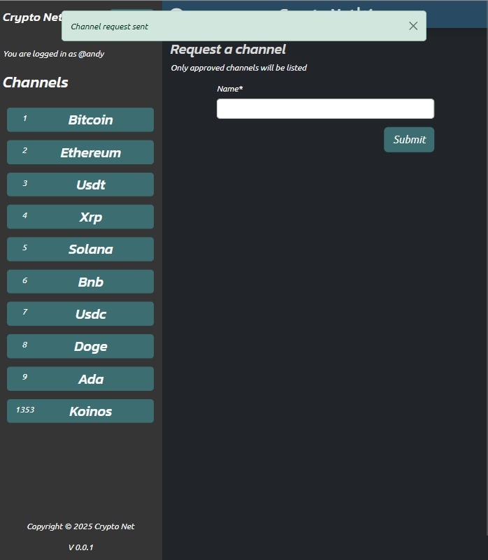

- Rejected channel message

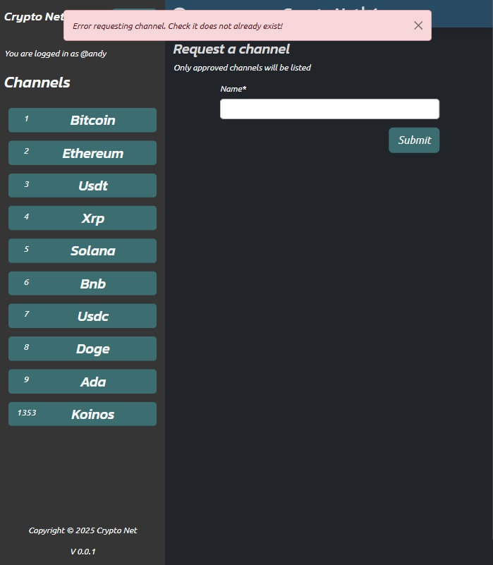

### Channel

On approved channels, authorized users can create content with images, read content, update their own content, and delete their content

Included features are:

- Users can see the channel name and number of posts in a channel

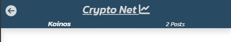

- Users can:
  - Create a post
  - View the number of likes on a post and also like a post
  - View the number of comments on a post, with a clickable link to the post detail template that lists all the comments for that post
  - View user profiles by clicking the user image or name

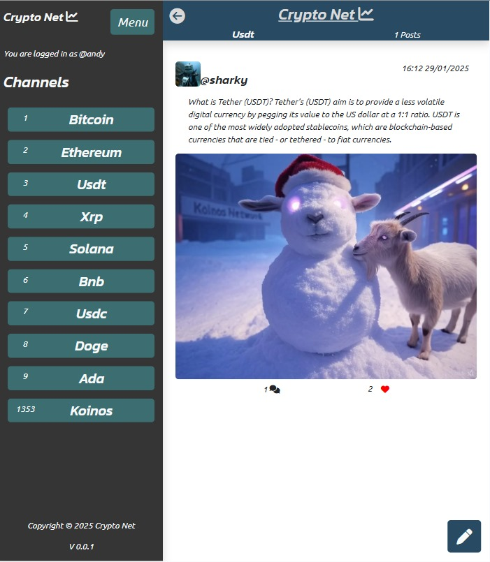

- Edit and delete there own posts

- A pop-up modal is available to create a post or edit a post

- Post modal

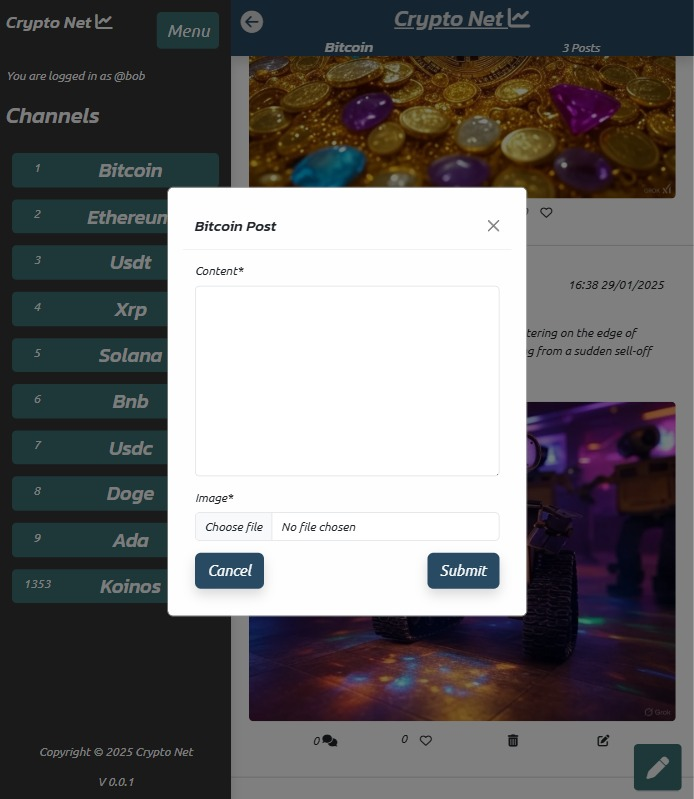

- Edit post modal

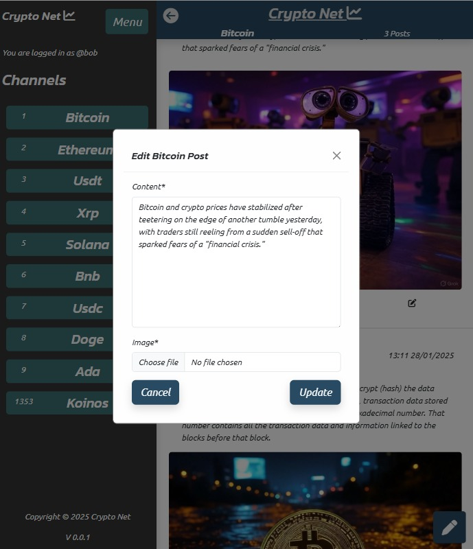

- A delete confirmation is required before deleting content

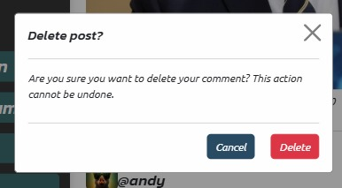

- Message Confirmation

A user will receive a message confirming whether the post was sent, updated or deleted

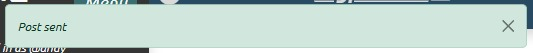

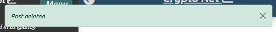

- Unathorised users are restricted to only view content

There is also a link at the top prompting users to log in in order to leave a post. This link directs to the sign in page

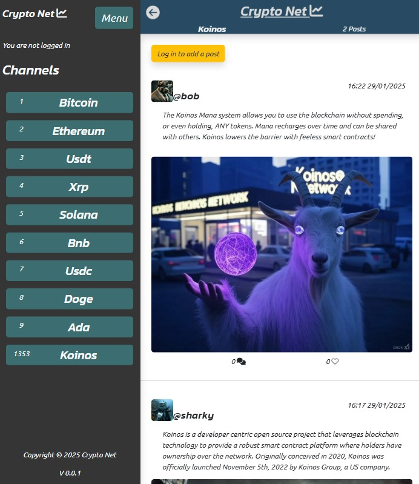

### Post

The comment link will take users to the post template, where they can view other comments on the post. Authorized users can add, edit, and delete their comments. There is also a comment count displayed at the top of the template

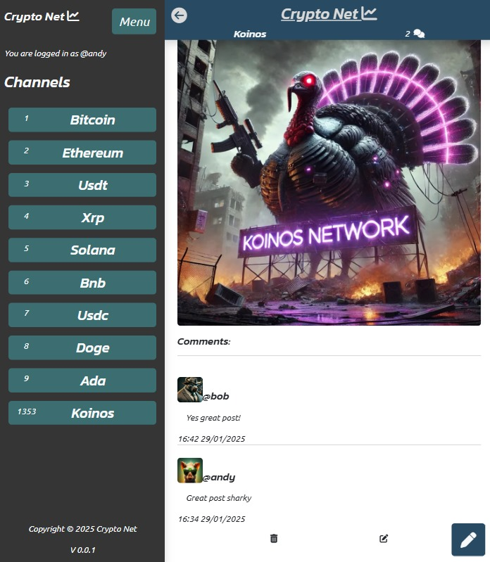

### Profile

The profile consists of three sections edit, account, and detail. 

A user's profile details can be viewed by all users through the profile image and name links on posts and comments, or a user’s own profile can be accessed through the navigational menu

Included is:

- A count of posts made by the user
- An option to link to edit the profile if the users is the authorised owner of the profile
- The user's image, bio, location and date joined
- All post created by the user

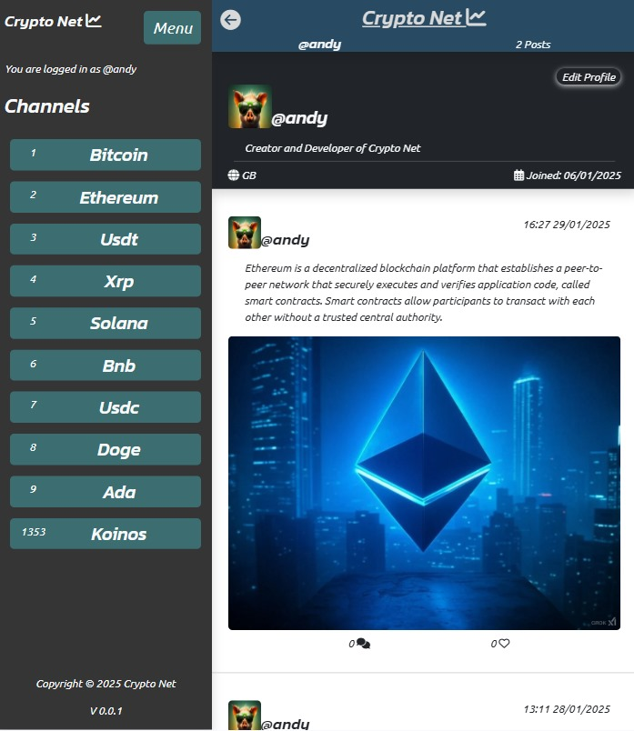

In the edit profile section, a user can update any relevant information they would like to display or delete their account

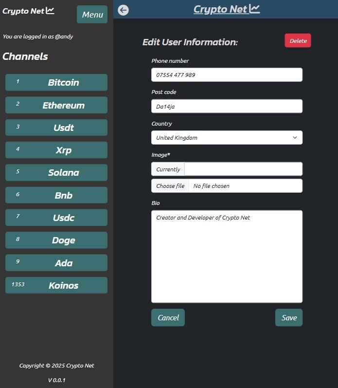

The user can view their account via the navigational menu, which will display all current relevant information and an option to edit their details

### 404 Page

Features a bouncy 404 image for peace of mind

- Animated 404.svg from [Loading](https://loading.io/)
- Information on 404 page [W3S](https://www.w3schools.com/django/django_404.php)

## Future Features

How deep is the rabbit hole?

Just to list a few. With more time, I would like to add the following features:

- An istance to like, delete or edit posts within the post_detail & profile_detail templates
- Edit user/username functionality
- Channel search bar
- User favorite channel list
- Email verification
- Report functionality
- CoinGecko API dynamic data input and channel validation

## Requirements

### Tools
- **Gunicorn** Python HTTP server for WSGI applications
- **Whitenoise** for serving of static files
- **Cloudinary** cloud storage for images

### Libraries
- **Psycopg2** Python PostgreSQL database adapter
- **Django Allauth** registration authentication managment
- **Django Crispy forms** super easy serving of crispy forms
- **Django Summernote** for rich text editing in admin panel
- **Django Countries** provides country choices for use with forms

## Deployment
This project was deployed using Heroku

**PostgreSQL**

This project uses PostgreSQL database provided by Code Institue

**Cloudinary API**

This project uses [Cloudinary](https://cloudinary.com/) for storing media files

### Heroku Deployment

Fork or clone this [repository](https://github.com/AndyV773/pp4)

Heroku requires 3 additional files for deployment
- requirements.txt
- Procfile
- runtime.txt

Ensure Procfile is added with the correct command to run gunicorn: 

`web: gunicorn cryptonet.wsgi`

- You can create a new Procile with the following command:

`echo web: gunicorn <app_name>.wsgi > Procfile`

- Replace <app_name> with the primary Django app name that locates settings.py

Ensure runtime.txt has the correct Python version:

`python-3.12`

- You can check Python version by running either command:

`python -V`

`python --version`

**Create a new app in Heroku**

- Click "New" in the Heroku dashboard and select "Create new app" from the drop down menu
- Add an app name (must be unique) and select your closest region (United States or Europe), then click "Create app"
- Navigate to the Settings tab within the new app, locate and click "Reveal Config Vars". Set the key and values. Here is an example:

| Key | Value |
| --- | --- |
| DATABASE_URL | <your_database_url> |
| SECRET_KEY | <your_secret_key> |
| CLOUDINARY_URL | cloudinary://<your_api_key>:<your_api_secret>@dpwhdmvce |
| DISABLE_COLLECTSTATIC | 1 (Can be used to temporary disable collection of static files) |

Once this is done, navigate to the "deploy" tab:

- Link the Heroku app to the GitHub repository
- Click on **Deploy Branch** in "Manual deploy" section

Alternatively, you can enable automatic deployments with every push to the repository by clicking "Enable Automatic Deploy" in the "Automatic Deploy" section

### Local Deployment

- Fork or clone this [repository](https://github.com/AndyV773/pp4)

- Install all requirements by running the following command in the terminal:

` pip3 install -r requirements.txt `

If you have your own packages or have installed other requirements, then you can updated the requirements.txt with the command:

`pip3 freeze --local > requirements.txt`

- Set Environment Varibles, here is an example [.env.example](https://github.com/AndyV773/pp4/blob/main/.env.example)

Once the project is cloned or forked, in order to run it locally, you'll need to follow these steps:

- Start the Django app: `python3 manage.py runserver`
- Stop the app once it's loaded: `CTRL+C` or `⌘+C` (Mac)
- Make any necessary migrations: `python3 manage.py makemigrations`
- Migrate the data to the database: `python3 manage.py migrate`
- Create a superuser: `python3 manage.py createsuperuser`
- Load fixtures (if applicable): `python3 manage.py loaddata file-name.json` (repeat for each file)
- Everything should be ready now, so run the Django app again: `python3 manage.py runserver`

## Testing
> **Note:**
>
> For Testing, please refer to [TESTING.md](TESTING.md)

## Credits
### Content

- Code Institute for [Code Institute Blog](https://github.com/Code-Institute-Solutions/blog/), Postgres database and deployment to Heroku
- [Django Project](https://www.djangoproject.com/)
- [W3S](https://www.w3schools.com/)
- [Stack Overflow](https://stackoverflow.com/)
- Front-end development framework [Bootstrap](https://getbootstrap.com/docs/)
- Entity Relationship Diagram [Lucid Chart](https://www.lucidchart.com/)
- Wireframes [Balsamiq](https://balsamiq.com/)
- The icons used were taken from [Font Awesome](https://fontawesome.com/)

### Media

- Images were created using Grok from [X](https://x.com/)
- Media storage [Cloudinary](https://cloudinary.com/)
- Favicon was generated using [Ionos](https://www.ionos.co.uk/tools/favicon-generator)
- Animated 404.svg was from [Loading](https://loading.io/)
- Optimise images with [Free Convert](https://www.freeconvert.com/)
