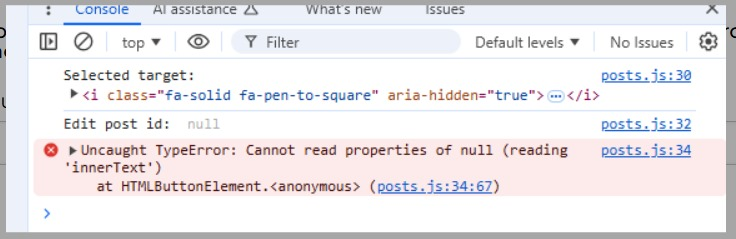

# Crypto Net

Crypto Net is a social networking platform designed specifically for individuals interested in cryptocurrencies, blockchain technology, and the rapidly evolving world of digital finance. This platform is tailored to those who want to stay updated with the latest trends, news, and discussions related to various crypto assets and projects. It is a hub where users can share their insights, articles, and commentary, as well as engage in conversations about all things crypto.

[Here is the live version of my project](https://cryptonet-0fc8d0019661.herokuapp.com/)

## User Story
**New User**
- I want to know what the site is for
- I want to easily use the platform, so that I can quickly start interacting
- I want to be able to look through content with minimal effort
- I want to be able to see content clearly and see the discussions in the comments
- I want to be able to see what channels are most popular with the most content and activity

**Returning User**
- I want to come back and see new content
- I want to be able to keep up to date with my favorite crypto currencies
- I want to add a post for new content
- I want to view comments on my post and join in with the discussions
- I want to see if there are any new channels
- I want to add a new channel for my favorite crypto currency

**Other Customer Scenarios**

**Site Adminstrator**
- As a site administrator, the platform should run smoothly and remain secure.
- As a site administrator, that the site remain.

## Features

### Typography

- **The site uses the following fonts:**
  - Base: [Ubuntu](https://fonts.google.com/specimen/Ubuntu)
  - Headers: [Kanit](https://fonts.google.com/specimen/Kanit)

The fonts were imported from [Google Fonts](https://fonts.google.com/)

### Color Scheme

- **The site uses the following colors:**
  - Jet: rgb(53, 53, 53)
  - Caribbean Current: rgb(60, 110, 113)
  - White: rgb(255, 255, 255)
  - Platinum: rgb(217, 217, 217)
  - Indigo Dye: #rgb(40, 75, 99)

This color pallet was made in [Coolors](https://coolors.co)

- **Additional colors**
  - Black from [Bootstraps](https://getbootstrap.com/docs/5.3/utilities/background/) default colors

- **Input message return**

## Bugs
### Solved Bugs
- **Event target get attribute with icons**
I had an issue with posting and editing comments. I couldn’t work out if it was the modal, the view, or the URL pattern. Sometimes it would work, and sometimes it would not. I spent some time trying different approaches with the three files and added some code in the JavaScript file to debug. I also checked the console and read the errors.

My return value from the getAttribute method was reading data-post_id as null. I thought this could have been an issue with the pop-up modal I was using. I ended turning to Code Institute tutoring, and they were very helpful.

The issue was far simpler than I had thought. Because I had used icons within the buttons, when using e.target.getAttribute in the JavaScript file, the data-post_id attribute was in the button element. However, nested within the button was the icon element, and since the icon was being targeted, it did not hold the data-post_id value. As a result, the return value was null, throwing an error with the rest of the JavaScript code.

To fix this issue, e.target.getAttribute was changed to target the parent element, e.target.parentElement.getAttribute. Additionally, I have adjusted the margin and padding of the icon and button to try and avoid targeting the wrong element.

This is a valuable lesson on why the MVP (Minimum Viable Product) and Agile approaches are the best methods to use. Building basic functionality and design first before advancing the front end.

- **Displaying comment count of a individual post**
I had an issue trying to display the comment count of a post within the channel_detail template. I was only able to return the total number of comments related to the channel and could only narrow the comments down to a single post when I was within the post_detail template.

I tried many approaches, including looping through the Post model or bringing post_id into the channel_detail view, but with no success. After turning to Code Institute tutoring, they came up with an interesting concept that fixed the issue.

- **Returning True or False for a liked post**
After fixing the issue with the comment count, this helped me use the same approach to manipulate the return value for True or False likes for registered users. Since the Code Institute example for likes used a Class Based View, they could use the self method within the class. However, this approach could not be used within a Function Based View.

- **Displaying files**
After adding Cloudinary, I wanted it to be possible for a user to upload images with their posts. The first thing that was needed was to include request.FILES within the form request, along with request.POST. Then, I had to enable enctype="multipart/form-data" within the form element to display the images. More extensive information can be found at [Django Project](https://docs.djangoproject.com/en/5.1/topics/http/file-uploads/)

- **Cloudinary http/https mixed content**
Once images could be displayed, there was a warning in the terminal regarding mixed content, as Cloudinary images were coming through as http while the site was https. I couldn’t find much about fixing this issue other than adding secure_url or secure = True within the .env file or templating. I also tried applying this in the views, but this approach did not work for me.

After looking at the URL, I realized I could return just the URL ID without the full address. So, I added the Cloudinary address with https and used templating to append the URL ID. I’m not sure if this was the best approach, but it works well.

I also originally had the images set to .jpg, which caused some performance issues. By changing the end of the URL to .webp, Cloudinary automatically optimized the return format, improving the performance.

### Remaing Bugs
- **aria-hidden="true"**

- **Allauth HTML Register Error**

## Testing
### Manual Testing
- Vigorous manual testing to ensure everything functions as expected

### Validator Testing
#### HTML
#### CSS
#### JavaScript
#### PEP8
  - There were errors in the [PEP8 Validator](https://pep8ci.herokuapp.com/), mainly related to whitespace and excessive line lengths. I had to reduce some lines in Django settings.py also.  
    
    

  - All errors have been fixed
    
    

#### Lighthouse Testing

## Deployment
This project was deployed using Heroku.
- **Steps for deployment**
  - Fork or clone this [repository](https://github.com/AndyV773/pp4)
  - Create a new Heroku app
  - Add Config Var in Heroku's settings. Here is [.env.example](https://github.com/AndyV773/pp4/blob/main/.env.example)
  - Link the Heroku app to the repository
  - Click on **Deploy**

## Credits
### Content

- Code Institute for [Code Institute Blog](https://github.com/Code-Institute-Solutions/blog/) and deployment to Heroku
- [Django Project](https://www.djangoproject.com/)
- [Boot Strap](https://getbootstrap.com/docs/)
- [W3S](https://www.w3schools.com/)
- [Stack Overflow](https://stackoverflow.com/)
- [Lucid Chart](https://www.lucidchart.com/)
- [Balsamiq](https://balsamiq.com/)
- The icons used were taken from [Font Awesome](https://fontawesome.com/)
- Animated 404.svg was from [Loading](https://loading.io/)

### Media

- Images were created using Grok from [X](https://x.com/)
