# Testing

## Manual Testing
- Vigorous manual testing to ensure everything functions as expected

#### Navigation 
- Ensured that all buttons and links function correctly and link to the correct templates 
- Confirmed that channel displays are correct, and link to the correct channels  

#### CRUD Fuctionality 
- **Channel tempalte:** Ensured all posts are created, read, updated and deleted correctly
  - Checked the post count is accurate
- **Add channel:** Ensured that adding a channel sends a request for admin approval
  - Ensured that channel ordering is correct  
- **Post template:**Ensured that all comments are created, read, updated and deleted correctly
  - Checked the comment count is accurate 
- **Contact template:** Ensured that contact details are posted correctly and the form autofills for users  
- **About template:** Ensured that details are displayed correctly and update times are accurate  
- **Profile templates:** Checked that user details are displayed correctly and can be edited in the Edit Profile section
   - Ensure correct user posts are displayed in profile template

#### User Management
- Verified that unauthorized users are blocked from restricted functionality
- Ensured that approved comments or posts are hidden when not approved
- Checked that user deletion works as expected    

## Automated Testing
- To be continued

### Validator Testing
#### HTML
I ensured that the website fully complyed with [W3S HTML Validator](https://validator.w3.org/)

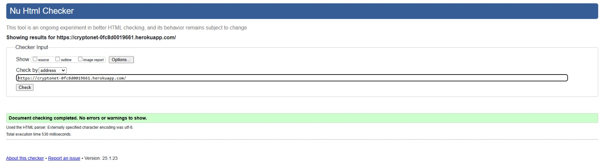

- Can find the results [here](https://validator.w3.org/nu/?doc=https%3A%2F%2Fcryptonet-0fc8d0019661.herokuapp.com%2F)

There was one issue with `form.as_p` withing allauth template. I replaced with crispy to resolve this.

| Template | results |
| :------ | :------: |
| about | 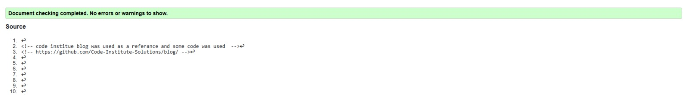 |
| contact |  |
| add_channel |  |
| channel_detail |  |
| index | 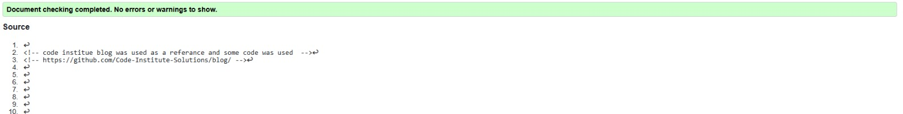 |
| post_detail | 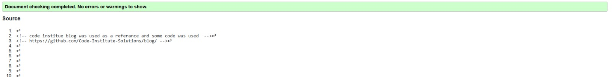 |
| edit_profile |  |
| profile_account | 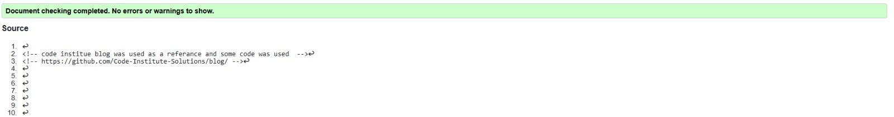 |
| profile_detail | 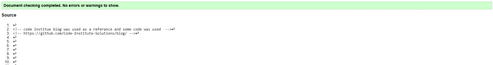 |
| login | 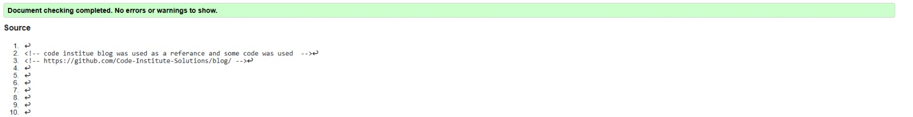 |
| logout | 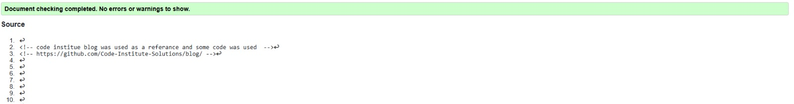 |
| signup | 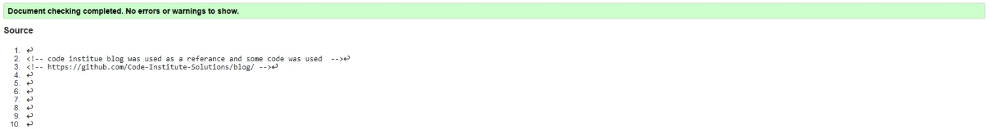 |
| 404 | 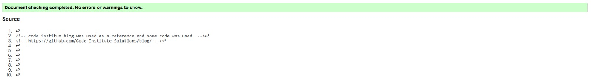 |

#### CSS

All CSS comply with [W3S CSS Validator](https://jigsaw.w3.org/)

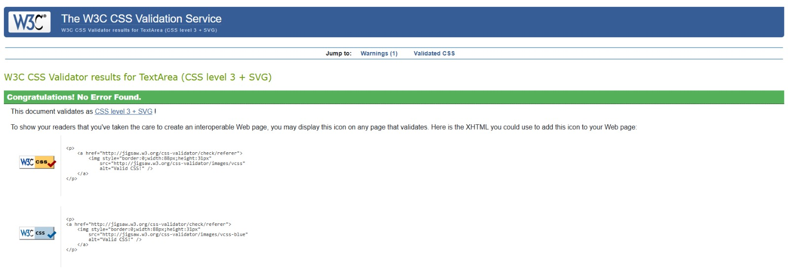

#### JavaScript

I have ensured that all JS file comply with [JS Hint Validator](https://jshint.com/)

#### PEP8

There were errors in the [PEP8 Validator](https://pep8ci.herokuapp.com/), mainly related to whitespace and excessive line lengths. I had to reduce some lines in Django settings.py also. 

  

  

- All errors have been fixed

  

  

#### Lighthouse Testing

- Proformace issues mainly with mobile due to images
- Low score for best practice due to third party cookies from cloudinary

| Template | Mobile | Desktop |
| :------ | :------: | :------: |
| about | 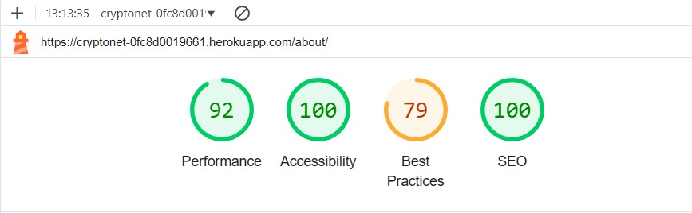 |  |
| contact |  | 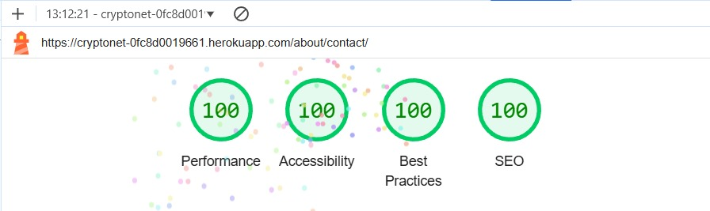 |
| add_channel | 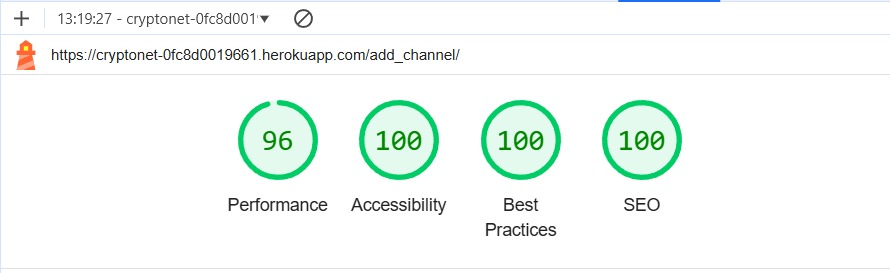 |  |
| channel_detail | 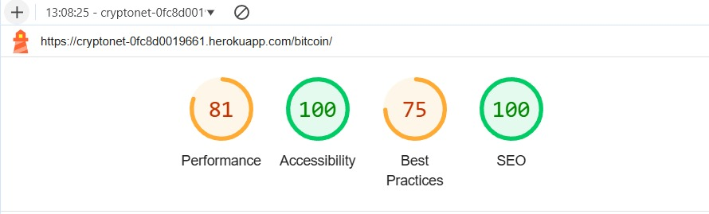 | 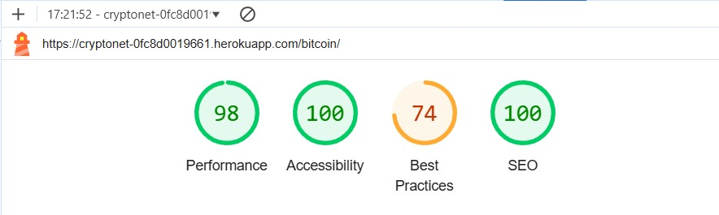 |
| index |  |  |
| post_detail | 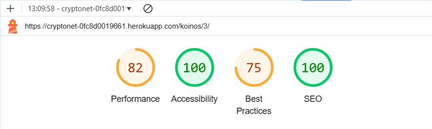 | 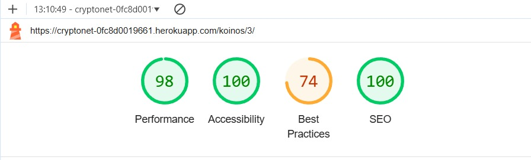 |
| edit_profile | 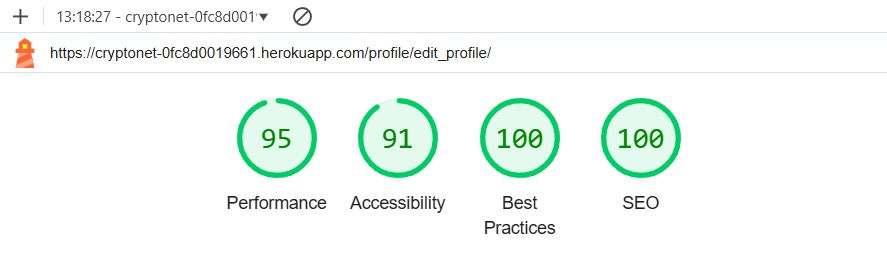 | 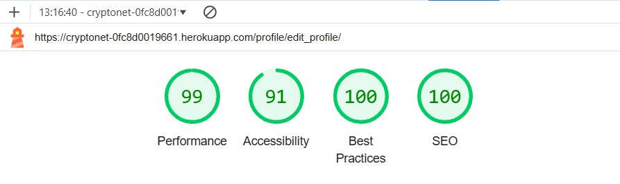 |
| profile_account | 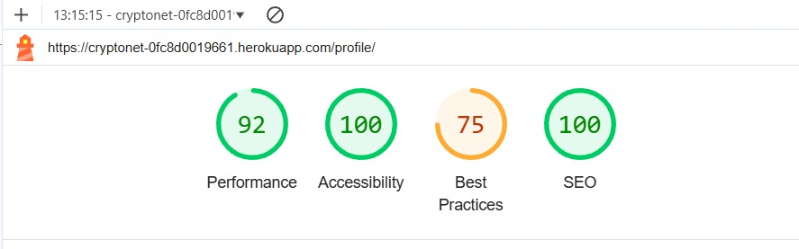 |  |
| profile_detail |  | 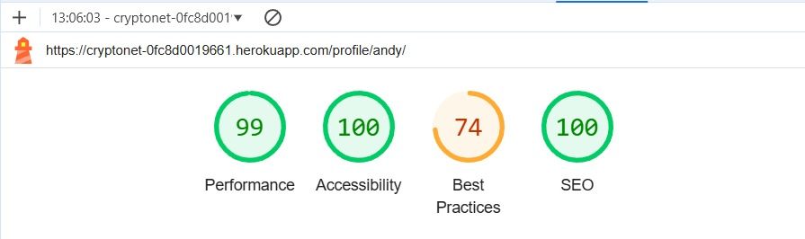 |
| login | 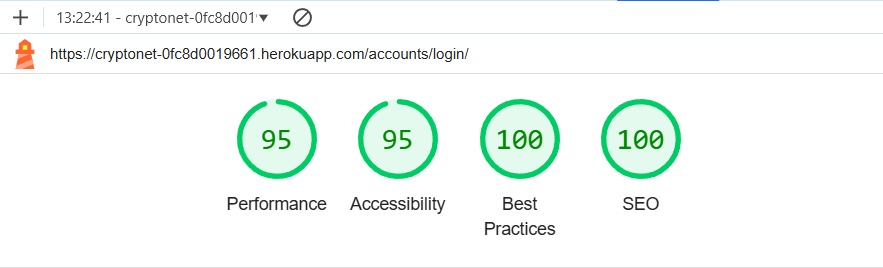 | 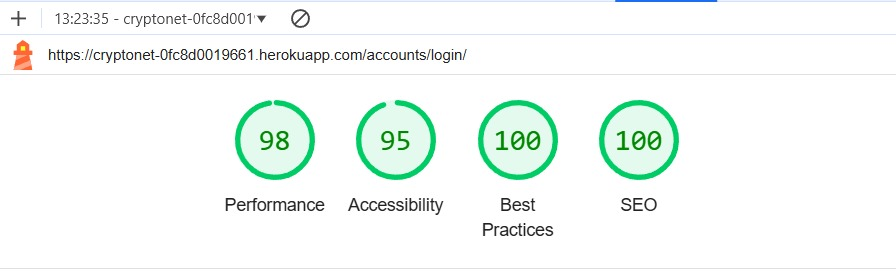 |
| logout | 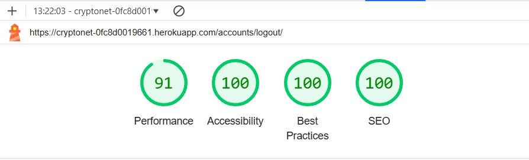 | 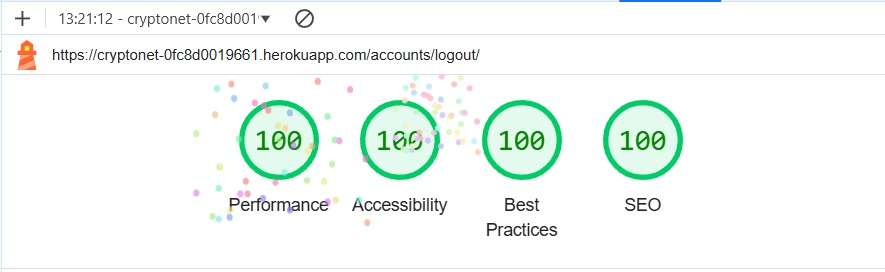 |
| signup | 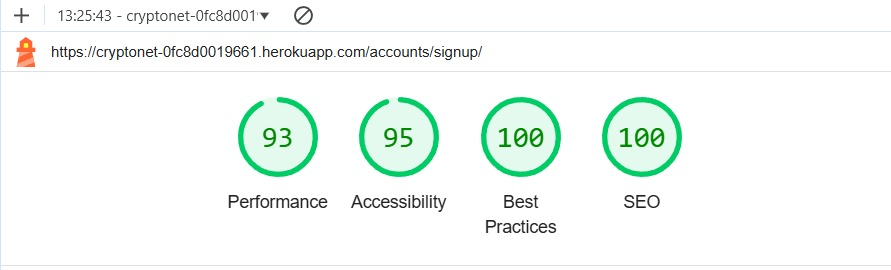 | 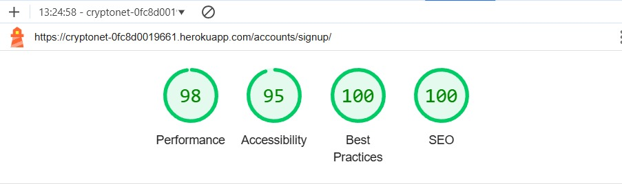 |
| 404 |  | 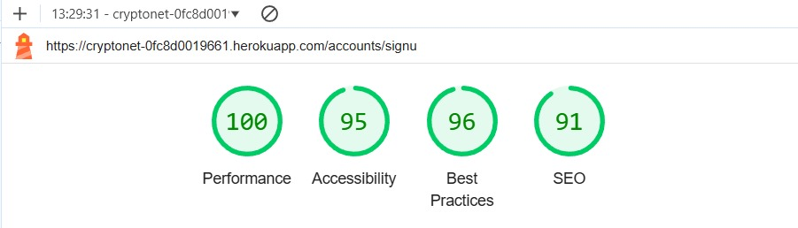 |

## Bugs
### Solved Bugs
- **Event target get attribute with icons**

  I had an issue with posting and editing comments. I couldn’t work out if it was the modal, the view, or the URL pattern. Sometimes it would work, and sometimes it would not. I spent some time trying different approaches with the three files and added some code in the JavaScript file to debug. I also checked the console and read the errors.

  My return value from the getAttribute method was reading data-post_id as null. I thought this could have been an issue with the pop-up modal I was using. I ended turning to Code Institute tutoring, and they were very helpful.

  The issue was far simpler than I had thought. Because I had used icons within the buttons, when using e.target.getAttribute in the JavaScript file, the data-post_id attribute was in the button element. However, nested within the button was the icon element, and since the icon was being targeted, it did not hold the data-post_id value. As a result, the return value was null, throwing an error with the rest of the JavaScript code.

  To fix this issue, e.target.getAttribute was changed to target the parent element, e.target.parentElement.getAttribute. Additionally, I have adjusted the margin and padding of the icon and button to try and avoid targeting the wrong element.

  This is a valuable lesson on why the MVP (Minimum Viable Product) and Agile approaches are the best methods to use. Building basic functionality and design first before advancing the front end.

  

  

- **Displaying comment count of a individual post**

  I had an issue trying to display the comment count of a post within the channel_detail template. I was only able to return the total number of comments related to the channel and could only narrow the comments down to a single post when I was within the post_detail template.

  I tried many approaches, including looping through the Post model or bringing post_id into the channel_detail view, but with no success. After turning to Code Institute tutoring, they came up with an interesting concept that fixed the issue.

- **Returning True or False for a liked post**

  After fixing the issue with the comment count, this helped me use the same approach to manipulate the return value for True or False likes for registered users. Since the Code Institute example for likes used a Class Based View, they could use the self method within the class. However, this approach could not be used within a Function Based View.

- **Displaying files**

  After adding Cloudinary, I wanted it to be possible for a user to upload images with their posts. The first thing that was needed was to include request.FILES within the form request, along with request.POST. Then, I had to enable enctype="multipart/form-data" within the form element to display the images. More extensive information can be found at [Django Project](https://docs.djangoproject.com/en/5.1/topics/http/file-uploads/)

- **Cloudinary http/https mixed content**

  Once images could be displayed, there was a warning in the terminal regarding mixed content, as Cloudinary images were coming through as http while the site was https. I couldn’t find much about fixing this issue other than adding secure_url or secure = True within the .env file or templating. I also tried applying this in the views, but this approach did not work for me.

  After looking at the URL, I realized I could return just the URL ID without the full address. So, I added the Cloudinary address with https and used templating to append the URL ID. I’m not sure if this was the best approach, but it works well.

  I also originally had the images set to .jpg, which caused some performance issues. By changing the end of the URL to .webp, Cloudinary automatically optimized the return format, improving the performance.

### Remaing Bugs
- **aria-hidden="true"**

  I have left this in the unsolved bugs, although the issue is currently only local.

  The setup started by using two Bootstrap modals in each channel_detail and post_deatil templates to keep it modular, one for delete confirmation and the other for posting and editing. However, when opening and closing one of the modals then moving to the other template, and repeating the process, I would get an error message in the console regarding aria-label = true. I tried many approaches to fix this, removing the element, setting it to false or undefined, trying to remove it dynamically with JS, adding aria-labels and aria-labelledby. I commenting out the modals narrowing it down to two modals with two triggers and then one modal with two triggers, with no success. In the end, the only approach that worked for me was to remove the Bootstrap modal entirely and use one from W3S. After doing this, the issue was resolved in the delete modal, but it persisted in the post/comment and edit modal that was still using Bootstrap.

  I decided to reach out to Code Institute tutoring to see if there was a solution. The tutor removed aria-label = true, and they no longer had the issue in their console, but it still persisted in mine. I tried using the browser in incognito mode (CTRL + Shift + N), but the issue remained. I then spoke with my mentor, who confirmed that the error was not in their terminal either, so it must be a local issue. 

  I have currently left the modals as they are, even though I’m still getting the error, but in the future, I plan to refactor the modals down to just one.

  

> **Note:**
>
> Return to [README.md](README.md)
