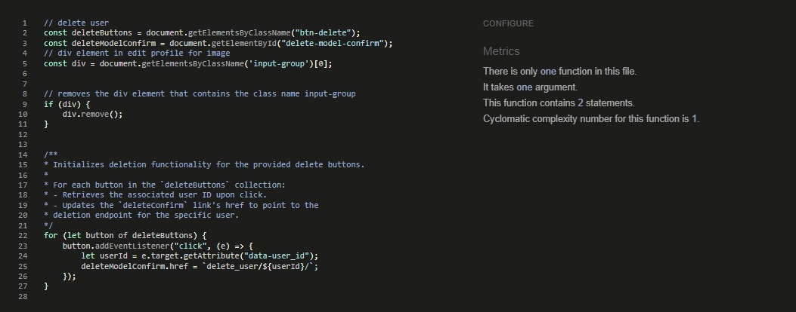
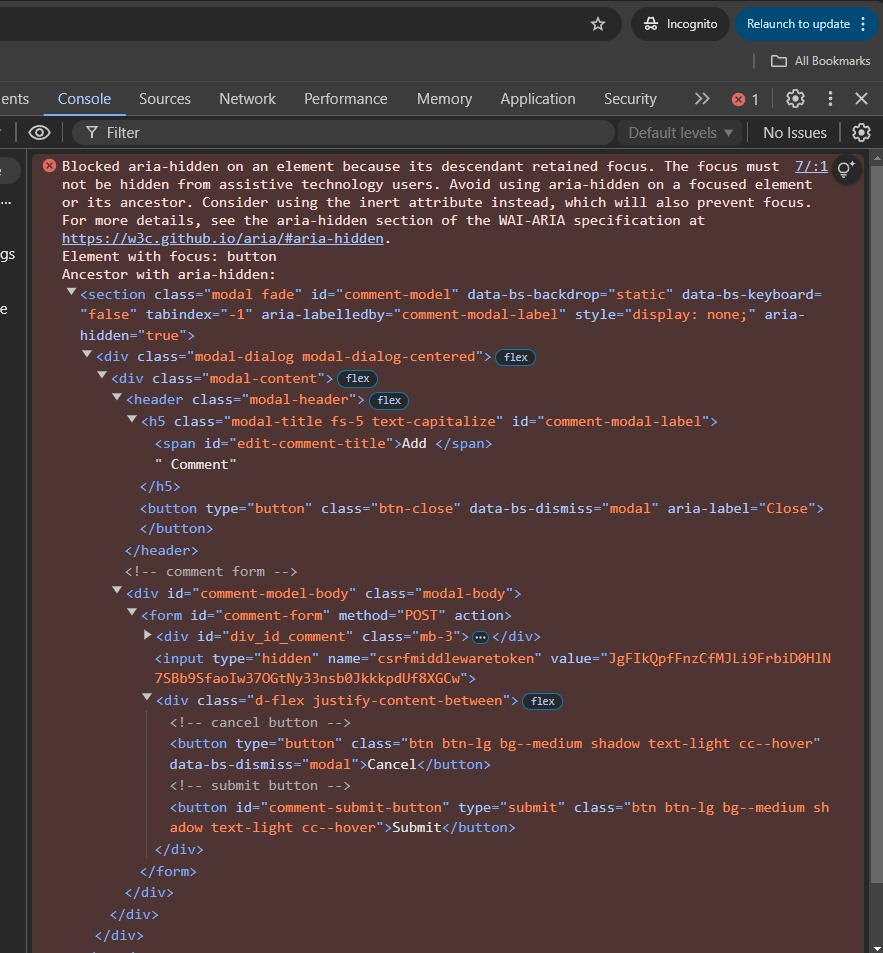

# Testing

## Manual Testing
- Vigorous manual testing to ensure everything functions as expected. The outcome was as followed:

### About

| Feature | Expected Outcome | Result |
| ---------- | ---------- | ---------- |
| Back icon | Returns to home | Pass |
| Hero image | Admin can choose to display an image or not | Pass |
| Title | Title is displayed correctly from the admin panel | Pass |
| Content | Content is displayed correctly from the admin panel | Pass |
| Updated on | Clearly displays the correct date when the About template was last updated | Pass |
| Get in touch link | Goes to the Contact template | Pass |

### Contact

| Feature | Expected Outcome | Result |
| ---------- | ---------- | ---------- |
| Back icon | Returns to home | Pass |
| Unauthorised user | Can post a contact request | Pass |
| Authorised user | Can post a contact request, and form is prefilled with username and email | Pass |
| Verification | Form will not submit if incorrect email is entered or any field is blank | Pass |
| Confirmation message | A clear message is displayed if the contact request is sent | Pass |
| Redirect | Form is cleared, and user is redirected to either a blank form or prefilled form if authorised | Pass |
| Admin control | Admin can filter for read contact requests | Pass |

### Add Channel

| Feature | Expected Outcome | Result |
| ---------- | ---------- | ---------- |
| Back icon | Returns to home | Pass |
| Unauthorised user | Hidden from unauthorised users in the navigation | Pass |
| Authorised user | Can post a channel request to admin if it does not already exist | Pass |
| Verification | Form will not submit if left blank or will return an error message if the requested channel already exists | Pass |
| Confirmation message | A clear message is displayed if the channel request is successful | Pass |
| Error message | A clear error message is displayed if there was an error with the request | Pass |
| Redirect | Form is cleared, and user is redirected to a blank form | Pass |
| Admin control | Admin can filter for unapproved channel requests, add their rank, and approve channels | Pass |
| Channel display | Approved channels are displayed in the channel list with their rank in ascending order | Pass |
 
### Channel Detail

| Feature | Expected Outcome | Result |
| ---------- | ---------- | ---------- |
| Back icon | Returns to home | Pass |
| Header | Displays the channel name and correct number of posts related to the channel | Pass |
| No posts | Displays a "No Posts" message and image if there are no posts on this channel | Pass |
| Unauthorised user | Displays a highlighted message at the top of the page linking to the sign in template if the user is not authorised. The post button is not visible. If the user is not the owner of a post, they cannot edit or delete it | Pass |
| Authorised user | An authorised user can post content, add images, edit, or delete their posts. They can also like posts | Pass |
| Content | Content is displayed clearly, showing the post author's name, profile image, time and date posted, content, and either a default or featured image. Posts are displayed in descending order | Pass |
| Profile links | The author's name and image are linked to their profile page | Pass |
| Comments link | Links to the post details template with the correct information for the post | Pass |
| Comment count | Displays the correct number of comments for the post | Pass |
| Liked posts | Authorised users can like and unlike posts | Pass |
| Liked count | Displays the correct number of likes on a post | Pass |
| Admin control | Admins can create, update, and delete posts. They can filter posts by channel or author, allowing them to unapprove them so that they are hidden | Pass |

### Home

| Features | Expected Outcome | Result |
| ---------- | ---------- | ---------- |
| content.js | Displays only a list of channels on devices with a screen width less than 576px | Pass |
| Channel list | Display correct details in the correct ranking order | Pass |
| Channel links | Links to the channel detail template display the correct details | Pass |
| Authorised user | An authorised user can comment on a post and edit, or delete their comments | Pass |

### Post Detail

| Feature | Expected Outcome | Result |
| ---------- | ---------- | ---------- |
| Back icon | Returns to related channel | Pass |
| Header | Displays the channel name and correct number of comments related to the post | Pass |
| No comments | Displays a "No Comment" message and image if there are no comments on this post | Pass |
| Unauthorised user | Displays a highlighted message at the top of the page linking to the sign in template if the user is not authorised. The comment button is not visible. If the user is not the owner of a comment, they cannot edit or delete it | Pass |
| Comments | Comments are displayed clearly, showing the comment author's name, profile image, time and date posted and content. Comments are displayed in descending order | Pass |
| Profile links | The author's name and image are linked to their profile page | Pass |
| Admin control | Admins can create, update, and delete comments. They can filter comments by channel or author, allowing them to unapprove them so that they are hidden | Pass |

### Edit Profile

| Feature | Expected Outcome | Result |
| ---------- | ---------- | ---------- |
| Back icon | Returns to profile account | Pass |
| Delete user | Deletes the user and returns to the home page as an unauthorised user | Pass |
| Form | Displays a prefilled form with the user's details, if any. Allows user's to updated all their information | Pass |
| Save | Saves the user's details and redirects to the profile account | Pass |
| Confirmation message | A clear message is displayed if the profile is saved successful | Pass |
| Cancel button | Returns to profile account | Pass |

### Profile Account

| Feature | Expected Outcome | Result |
| ---------- | ---------- | ---------- |
| Back icon | Returns to home | Pass |
| User's information | Displays all the correct updated information about the user | Pass |
| Edit button | Linked to the edit profile template with all the related information | Pass |

### Profile Detail

| Feature | Expected Outcome | Result |
| ---------- | ---------- | ---------- |
| Back icon | Returns to the previous refered url | Pass |
| Header | Displays the user profile's name and correct number of posts related to the user | Pass |
| Edit profile button | Only displayed if the user profile is related to user. Linked to edit profile template | Pass |
| Profile information | Displays the user's profile image and clear information about the user. Related to the user's account | Pass |
| User's posts | Displays all posts related to the user | Pass |

### Login

| Feature | Expected Outcome | Result |
| ---------- | ---------- | ---------- |
| Back icon | Returns to home | Pass |
| Login | Unauthorised users can login and are redirected to the home page, as an authorised user | Pass |

### Logout

| Feature | Expected Outcome | Result |
| ---------- | ---------- | ---------- |
| Back icon | Returns to home | Pass |
| Login | Authorised users can logout and are redirected to the home page, as an unauthorised user | Pass |

### Signup

| Feature | Expected Outcome | Result |
| ---------- | ---------- | ---------- |
| Back icon | Returns to home | Pass |
| Sign up | Unauthorised users can sign up | Pass |
| Sign up | Only unique usernames allowed (Except, uppercase and lowercase variations are considered different, e.g., 'andy' and 'Andy' are treated as separate usernames) | Pass |
| Redirect | Once users sign up, they are redirected to the home page as an authorised user | Pass |

### 404

| Feature | Expected Outcome | Result |
| ---------- | ---------- | ---------- |
| Back icon | Returns to home | Pass |
| Home link | Returns to home | Pass |
| 404 image | Bounces | Pass |

### Navigation

| Feature | Expected Outcome | Result |
| ---------- | ---------- | ---------- |
| Back icon | Closes menu | Pass |
| Resposive design | Takes up the full width on screens smaller than 576px and 67% on larger screens | Pass |
| Burger/Menu button | Opens and closes menu. Changes depending on width of screen | Pass |
| Unauthorised user's | Displays correct links | Pass |
| Authorised user's | Displays correct links | Pass |
| Links | All links verified that the go to the correct destinations | Pass |

## Automated Testing
- To be continued

### Validator Testing
#### HTML
I ensured that the website fully complyed with [W3S HTML Validator](https://validator.w3.org/)

- Can find the results [here](https://validator.w3.org/nu/?doc=https%3A%2F%2Fcryptonet-0fc8d0019661.herokuapp.com%2F)

There was one issue with `form.as_p` withing allauth template. I replaced with crispy to resolve this.

| Template | results |
| :------ | :------: |
| about |  |
| contact |  |
| add_channel |  |
| channel_detail |  |
| index |  |
| post_detail |  |
| edit_profile |  |
| profile_account |  |
| profile_detail |  |
| login |  |
| logout |  |
| signup |  |
| 404 |  |

#### CSS

All CSS comply with [W3S CSS Validator](https://jigsaw.w3.org/)

#### JavaScript

I have ensured that all JS file comply with [JS Hint Validator](https://jshint.com/)

| JavaScript File | Results |
| ------ | ------ |
| comments |  | 
| content |  | 
| posts |  | 
| script |  | 
| user |  | 

#### PEP8

There were errors in the [PEP8 Validator](https://pep8ci.herokuapp.com/), mainly related to whitespace and excessive line lengths. I had to reduce some lines in Django settings.py also. 

- Errors from crypto_channel views.py, and settings.py:

  

  

- All errors have been fixed

  

  

- Just for clarification, here are some of the mian results:

| Apps | Models | Views |
| ---- | ---- | ---- |
| about |  |  |
| crypto_channel |  |  |
| profile |  |  |

#### Lighthouse Testing

- Performace issues mainly with mobile due to images
- Low score for best practice due to third party cookies from cloudinary

| Template | Mobile | Desktop |
| :------ | :------: | :------: |
| about |  |  |
| contact |  |  |
| add_channel |  |  |
| channel_detail |  |  |
| index |  |  |
| post_detail |  |  |
| edit_profile |  |  |
| profile_account |  |  |
| profile_detail |  |  |
| login |  |  |
| logout |  |  |
| signup |  |  |
| 404 |  |  |

## Bugs
### Solved Bugs
- **Event target get attribute with icons**

  I had an issue with posting and editing comments. I couldn’t work out if it was the modal, the view, or the URL pattern. Sometimes it would work, and sometimes it would not. I spent some time trying different approaches with the three files and added some code in the JavaScript file to debug. I also checked the console and read the errors.

  My return value from the getAttribute method was reading data-post_id as null. I thought this could have been an issue with the pop-up modal I was using. I ended turning to Code Institute tutoring, and they were very helpful.

  The issue was far simpler than I had thought. Because I had used icons within the buttons, when using e.target.getAttribute in the JavaScript file, the data-post_id attribute was in the button element. However, nested within the button was the icon element, and since the icon was being targeted, it did not hold the data-post_id value. As a result, the return value was null, throwing an error with the rest of the JavaScript code.

  To fix this issue, e.target.getAttribute was changed to target the parent element, e.target.parentElement.getAttribute. Additionally, I have adjusted the margin and padding of the icon and button to try and avoid targeting the wrong element.

  This is a valuable lesson on why the MVP (Minimum Viable Product) and Agile approaches are the best methods to use. Building basic functionality and design first before advancing the front end.

  

  

- **Displaying comment count of a individual post**

  I had an issue trying to display the comment count of a post within the channel_detail template. I was only able to return the total number of comments related to the channel and could only narrow the comments down to a single post when I was within the post_detail template.

  I tried many approaches, including looping through the Post model or bringing post_id into the channel_detail view, but with no success. After turning to Code Institute tutoring, they came up with an interesting concept that fixed the issue.

- **Returning True or False for a liked post**

  After fixing the issue with the comment count, this helped me use the same approach to manipulate the return value for True or False likes for registered users. Since the Code Institute example for likes used a Class Based View, they could use the self method within the class. However, this approach could not be used within a Function Based View.

- **Displaying files**

  After adding Cloudinary, I wanted it to be possible for a user to upload images with their posts. The first thing that was needed was to include request.FILES within the form request, along with request.POST. Then, I had to enable enctype="multipart/form-data" within the form element to display the images. More extensive information can be found at [Django Project](https://docs.djangoproject.com/en/5.1/topics/http/file-uploads/)

- **Cloudinary http/https mixed content**

  Once images could be displayed, there was a warning in the terminal regarding mixed content, as Cloudinary images were coming through as http while the site was https. I couldn’t find much about fixing this issue other than adding secure_url or secure = True within the .env file or templating. I also tried applying this in the views, but this approach did not work for me.

  After looking at the URL, I realized I could return just the URL ID without the full address. So, I added the Cloudinary address with https and used templating to append the URL ID. I’m not sure if this was the best approach, but it works well.

  I also originally had the images set to .jpg, which caused some performance issues. By changing the end of the URL to .webp, Cloudinary automatically optimized the return format, improving the performance.

### Remaing Bugs
- **aria-hidden="true"**

  I have left this in the unsolved bugs, although the issue is currently only local.

  The setup started by using two Bootstrap modals in each channel_detail and post_deatil templates to keep it modular, one for delete confirmation and the other for posting and editing. However, when opening and closing one of the modals then moving to the other template, and repeating the process, I would get an error message in the console regarding aria-label = true. I tried many approaches to fix this, removing the element, setting it to false or undefined, trying to remove it dynamically with JS, adding aria-labels and aria-labelledby. I commenting out the modals narrowing it down to two modals with two triggers and then one modal with two triggers, with no success. In the end, the only approach that worked for me was to remove the Bootstrap modal entirely and use one from W3S. After doing this, the issue was resolved in the delete modal, but it persisted in the post/comment and edit modal that was still using Bootstrap.

  I decided to reach out to Code Institute tutoring to see if there was a solution. The tutor removed aria-label = true, and they no longer had the issue in their console, but it still persisted in mine. I tried using the browser in incognito mode (CTRL + Shift + N), but the issue remained. I then spoke with my mentor, who confirmed that the error was not in their terminal either, so it must be a local issue. 

  I have currently left the modals as they are, even though I’m still getting the error, but in the future, I plan to refactor the modals down to just one.

  

> **Note:**
>
> Return to [README.md](README.md)
